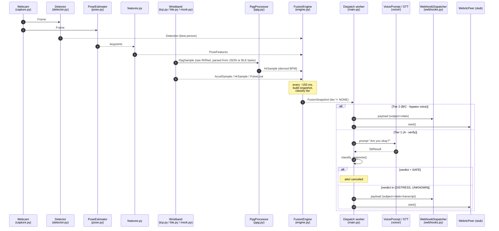

# KineticPulse Developer Manual

A working guide for software engineers extending this codebase. The
[README](../README.md) describes **what** KineticPulse is; this manual
describes **how to work in it**. If you only have 5 minutes, read sections
[1](#1-get-running-in-10-minutes) and [4](#4-how-a-fall-becomes-an-alert).

## Contents

1. [Get running in 10 minutes](#1-get-running-in-10-minutes)
2. [Repository map](#2-repository-map)
3. [Module-by-module guide](#3-module-by-module-guide)
4. [How a fall becomes an alert](#4-how-a-fall-becomes-an-alert)
5. [Conventions and patterns](#5-conventions-and-patterns)
6. [Cookbook: common tasks](#6-cookbook-common-tasks)
7. [Testing](#7-testing)
8. [Hardware integration milestones](#8-hardware-integration-milestones)
9. [Debugging and inspection](#9-debugging-and-inspection)
10. [Pitfalls and gotchas](#10-pitfalls-and-gotchas)
11. [PR checklist](#11-pr-checklist)
12. [Glossary](#12-glossary)

---

## 1. Get running in 10 minutes

```bash
git clone https://github.com/kingsman1960/KineticPulse.git
cd KineticPulse
python -m venv .venv

# Windows
.venv\Scripts\activate
# macOS / Linux
source .venv/bin/activate

pip install -r requirements.txt
python -m pytest tests/                # should print 33 passed
```

Run the full Pipeline 2 with no hardware required:

```bash
cp config.example.yaml config.yaml
python -m kineticpulse.main --config config.yaml --mock-ble --mock-stt --no-camera
```

What you should see: log lines from BLE (mock), the fusion engine
("monitoring", "Fusion: tier=..."), and the dispatcher describing what it
would have sent. `Ctrl+C` to stop.

Then try a scripted fall:

```bash
python -m kineticpulse.main --config config.yaml --mock-ble --mock-ble-scenario fall_c_syncope --mock-stt --no-camera
```

You should see a Tier 2 cardiac alert fire after ~7 s (5 s warm-up + 2 s
pulse-loss accumulation).

---

## 2. Repository map

```
KineticPulse/
├── kineticpulse/        # The runtime package (Pipeline 2). Production code.
├── scripts/             # Stand-alone executables (training, eval, export, dataset merge).
├── configs/             # YAML configs that ship with the repo (training hyperparams).
├── tests/               # pytest suite (36 tests; one needs trained weights, the rest run anywhere).
├── dataset/             # gitignored, populated by scripts/merge_datasets.py.
├── docs/                # This manual + supporting docs.
├── runs/                # gitignored, output of training/eval (best.pt etc.).
├── config.example.yaml  # Runtime config template (copy to config.yaml).
├── requirements.txt     # Python deps; Jetson-only ones commented at the bottom.
├── README.md            # Product overview + getting-started.
└── .gitignore           # Excludes dataset/, runs/, weights, secrets, OS junk.
```

### What lives where

| Looking for... | Look here |
|---|---|
| Pipeline 2 runtime code | `kineticpulse/` |
| The async orchestrator that wires everything together | [kineticpulse/main.py](../kineticpulse/main.py) |
| Runtime config schema (the dataclasses YAML loads into) | [kineticpulse/config.py](../kineticpulse/config.py) |
| Training the YOLOv8 fall detector | [scripts/train.py](../scripts/train.py) + [configs/train.yaml](../configs/train.yaml) |
| Evaluating a trained checkpoint | [scripts/eval.py](../scripts/eval.py) |
| Exporting weights for deployment | [scripts/export.py](../scripts/export.py) |
| Dataset merge tooling (3 source datasets → 1) | [scripts/merge_datasets.py](../scripts/merge_datasets.py) + [dataset/README.md](../dataset/README.md) |
| PRD section 5 tier logic | [kineticpulse/fusion/tiers.py](../kineticpulse/fusion/tiers.py) |
| BLE wristband client and mock | [kineticpulse/sensors/ble.py](../kineticpulse/sensors/ble.py) |
| MAX30102 raw-PPG decoder + BPM estimator | [kineticpulse/sensors/ppg.py](../kineticpulse/sensors/ppg.py) |
| Webhook dispatcher and alert payload | [kineticpulse/alerts/](../kineticpulse/alerts/) |
| The product overview / pitch | [README.md](../README.md) |

---

## 3. Module-by-module guide

Each module is self-contained and exposes a small public API through its
`__init__.py`. When extending the system, **work module-by-module** and
keep your changes behind the same interface so the orchestrator
doesn't need to learn about them.

### 3.1 `kineticpulse.config`

Loads YAML into a tree of frozen-ish dataclasses defined in
[config.py](../kineticpulse/config.py). All runtime knobs live here. To
add a new tunable:

1. Add a field to the relevant `*Config` dataclass with a default.
2. Add a corresponding key to `config.example.yaml`.
3. Read it from the module that needs it. **Never** read environment
   variables or hard-code values in module code.

### 3.2 `kineticpulse.vision`

Capture, detection, pose, and pose-feature extraction.

| File | Purpose | Public API |
|---|---|---|
| [capture.py](../kineticpulse/vision/capture.py) | Stream frames from USB/CSI/RTSP/file via OpenCV (with GStreamer pipelines on Jetson). Bounded queue with drop-oldest backpressure. | `Frame`, `FrameSource`, `FrameQueue`, `build_source(cfg)` |
| [detector.py](../kineticpulse/vision/detector.py) | Loads `.pt` / `.onnx` / `.engine` weights via Ultralytics, returns one detection per person per frame. 4-class output: `fallen` / `falling` / `stand` / `sitting`. | `FallDetector`, `Detection`, `PostureClass` |
| [pose.py](../kineticpulse/vision/pose.py) | Pretrained YOLOv8n-pose wrapper, returns 17 COCO keypoints per person. | `PoseEstimator`, `PoseResult` |
| [features.py](../kineticpulse/vision/features.py) | Pure-math feature extraction (torso angle, AR, velocity, stillness). No dependencies on the rest of the package - **fully unit-tested**. | `PoseFeatures`, `extract_features(...)` |

To add a new camera source type, subclass `FrameSource`, override
`_pipeline()`, and register it in `build_source()`.

### 3.3 `kineticpulse.sensors`

Wristband telemetry — TCP server (production), BLE client (legacy
fallback), parsers, and the on-Jetson PPG processor.

| File | Purpose |
|---|---|
| [parser.py](../kineticpulse/sensors/parser.py) | `SensorEvent` dataclasses (`AccelSample` / `HrSample` / `PulseLost`) **plus** the binary BLE-packet decoders. Standalone — no asyncio, no bleak. |
| [ppg.py](../kineticpulse/sensors/ppg.py) | MAX30102 raw-PPG packet decoder (`parse_ppg_packet`) and the BPM estimator (`PpgProcessor`, peak detection, no SciPy). Used by both transports. |
| [tcp.py](../kineticpulse/sensors/tcp.py) | **`TcpSensorServer`** — single-tenant `asyncio` TCP server bound on `wristband.tcp_host:tcp_port`. Reads newline-delimited JSON from the wristband (`{"type":"hr",...}` / `accel` / `ppg` / `pulse_lost` / `hello`) and emits `SensorEvent`s. This is the primary path. |
| [ble.py](../kineticpulse/sensors/ble.py) | Legacy `bleak`-based `BleClient` (auto-reconnect with exponential backoff). Activated by `wristband.transport: ble` plus a configured `wristband.mac`. Kept for fallback and future BLE wearables. |
| [mock.py](../kineticpulse/sensors/mock.py) | `MockSensorClient` (alias `MockBleClient` for back-compat) — transport-agnostic synthetic generator that scripts the four PRD §5 scenarios. Activated by `--mock-ble`. |
| [`__init__.py`](../kineticpulse/sensors/__init__.py) | Exports `build_sensor_client()`, the factory that picks TCP / BLE / mock based on `cfg.transport` and the `--mock-ble` flag. |

`--mock-ble` and `--mock-ble-scenario` (aliases: `--mock-sensors` /
`--mock-sensors-scenario`) bypass both transports and route through
`build_sensor_client(..., mock=True)`, so the orchestrator code path is
identical whether real TCP, real BLE, or the synthetic generator is in
use.

### 3.4 `kineticpulse.voice`

| File | Purpose |
|---|---|
| [prompts.py](../kineticpulse/voice/prompts.py) | `PromptPlayer` plays "Are you okay?" via `pyttsx3` (works on Windows/macOS/Linux). Falls back to logging when audio output is unavailable. |
| [stt.py](../kineticpulse/voice/stt.py) | `WhisperStt` (faster-whisper, real microphone) + `MockStt` (returns a canned utterance). `build_stt()` picks based on the `--mock-stt` flag. |
| [safe_words.py](../kineticpulse/voice/safe_words.py) | Classify a transcript into `VoiceVerdict.{SAFE, DISTRESS, UNKNOWN}`. Distress matches take priority over safe matches. |

### 3.5 `kineticpulse.fusion`

The heart of the system. Three files, layered:

| File | What it is | What it consumes | What it produces |
|---|---|---|---|
| [rules.py](../kineticpulse/fusion/rules.py) | Signature primitives | Raw samples + thresholds | `PoseSignature`, `AccelSignature`, `HrSignature` |
| [tiers.py](../kineticpulse/fusion/tiers.py) | PRD §5 classifier (one function: `classify`) | Three signatures | `TierDecision(tier, scenario, reason)` |
| [engine.py](../kineticpulse/fusion/engine.py) | Async windowed loop | Detections + features + sensor events | `FusionSnapshot` (the snapshot passed to alerts/WebRTC) |

The fusion engine is **stateless about decisions** — every snapshot is
re-derived from windowed history. This is intentional: it means you can
unit-test the rules without touching the engine. The "did we already
fire?" cooldown lives in `kineticpulse/main.py`'s dispatch worker.

### 3.6 `kineticpulse.alerts`

| File | Purpose |
|---|---|
| [payload.py](../kineticpulse/alerts/payload.py) | Build the JSON payload sent to webhooks. PRD §2.3 fields: subject ID, location, nature, scenario, severity, vitals, detector. |
| [webhooks.py](../kineticpulse/alerts/webhooks.py) | Async `httpx` dispatcher. Sends to every enabled webhook in parallel with a 5 s timeout; failures are logged, never raised. |

### 3.7 `kineticpulse.temporal` (stub)

[stgcn.py](../kineticpulse/temporal/stgcn.py) is a deterministic
pass-through implementation of an ST-GCN-style action head. When we
have temporal-keypoint fall data, the only file that changes is this
one — the orchestrator and fusion engine are unaffected because the
interface is fixed.

### 3.8 `kineticpulse.webrtc` (stub)

[peer.py](../kineticpulse/webrtc/peer.py) exposes the `start` / `stop`
async interface the orchestrator calls, but the real `aiortc` peer is
not yet wired (pending signaling-server design).

### 3.9 `kineticpulse.utils`

| File | Purpose |
|---|---|
| [logging.py](../kineticpulse/utils/logging.py) | `configure_logging(level, json_format)` + `get_logger(name)`. Plain text by default; JSON when `logging.json: true` in config. |
| [timing.py](../kineticpulse/utils/timing.py) | `now_ms()` + `MonotonicClock`. **Always use these for cross-modality timestamps** — never `time.time()` (wall-clock drift breaks fusion). |

---

## 4. How a fall becomes an alert

The end-to-end story, top to bottom, in async terms. Every arrow is a
bounded `asyncio.Queue` or `Queue` (drop-oldest where latency matters).



Latency budget on Orin Nano: vision ~40-70 ms, fusion ~1 ms, total to
"snapshot ready" ~80 ms. The 10 s voice-verify window dominates Tier 1
total latency; Tier 2 fires within ~200 ms of the triggering condition.

---

## 5. Conventions and patterns

These are not negotiable — they make the codebase predictable.

### 5.1 Async first, threads only when forced

The orchestrator is `asyncio`. Blocking work (Ultralytics inference,
Whisper transcription) goes through
`loop.run_in_executor(executor, ...)`. **Never** add a bare blocking call
to an async coroutine.

### 5.2 Bounded queues with drop-oldest

Every inter-stage queue is bounded. When full, the producer **drops the
oldest item, not the new one**. This keeps end-to-end latency bounded
in the worst case. See `FrameQueue.put` in
[capture.py](../kineticpulse/vision/capture.py) and the `_submit`
helpers in [tcp.py](../kineticpulse/sensors/tcp.py),
[ble.py](../kineticpulse/sensors/ble.py), and
[mock.py](../kineticpulse/sensors/mock.py).

### 5.3 Mock-first design

Every external-input module ships a mock with the same interface:

| Real | Mock | Switch |
|---|---|---|
| `TcpSensorServer` / `BleClient` | `MockSensorClient` (alias `MockBleClient`) | `--mock-ble` (alias `--mock-sensors`) |
| `WhisperStt` | `MockStt` | `--mock-stt` |
| (camera) | `--no-camera` | flag |
| `httpx` webhook | (webhook with `enabled: false` no-ops) | config |
| TTS via pyttsx3 | logs the prompt | automatic on platforms without audio |

Adding a new external dependency? **Write the mock at the same time.**
Otherwise the rest of the team can't develop without your hardware.

### 5.4 Time-sync via `MonotonicClock`

All timestamps are integer **monotonic milliseconds** since process
start (see [utils/timing.py](../kineticpulse/utils/timing.py)). Wall
clock and `time.time()` are forbidden in the runtime path — they drift
on NTP adjustments and break sensor fusion windows.

### 5.5 Config drives everything tunable

If you find yourself writing a magic number, add it to
[config.py](../kineticpulse/config.py) and surface it in
[config.example.yaml](../config.example.yaml) with a comment.

### 5.6 Dataclasses for data, never dicts

Every event flowing through the pipeline is a dataclass with explicit
fields:

- `Frame`, `Detection`, `PoseResult`, `PoseFeatures`
- `AccelSample`, `HrSample`, `PulseLost`, `PpgSample`
- `TierDecision`, `FusionSnapshot`, `AlertPayload`

When you add a new event type, follow the pattern: dataclass with a
`timestamp_ms` field.

### 5.7 No silent failures, no exceptions across stages

External boundaries (BLE callback, webhook POST, file I/O) **catch and
log**, never raise. A misconfigured Slack URL must not crash the BLE
ingest loop. Internal logic errors are different: those should raise.

### 5.8 UTF-8 stdout on Windows

Every script that prints to the console reconfigures stdout to UTF-8 at
the top. Pattern lives in [scripts/train.py](../scripts/train.py) and
[scripts/merge_datasets.py](../scripts/merge_datasets.py). Copy it into
any new console-printing entry point — the default `cp949` / `cp1252`
codepage on Korean / Western European Windows chokes on em dashes and
other characters.

---

## 6. Cookbook: common tasks

### 6.1 Add a Slack webhook

In `config.yaml`:

```yaml
alerts:
  webhooks:
    - name: slack
      url: "https://hooks.slack.com/services/T.../B.../..."
      headers: {}
      enabled: true
```

No code change required.

### 6.2 Tighten the seizure HR threshold

```yaml
thresholds:
  hr_seizure_low: 140   # was 130
```

Rule logic picks it up automatically. Re-run
`python -m pytest tests/test_fusion_rules.py -v` to confirm scenarios still pass.

### 6.3 Retrain the detector with different hyperparameters

Edit [configs/train.yaml](../configs/train.yaml) (or pass overrides):

```bash
python scripts/train.py --model yolov8n.pt --epochs 50 --batch 8 --name kp_v2
python scripts/eval.py --weights runs/detect/kp_v2/weights/best.pt
```

Then point `config.yaml` at the new weights:

```yaml
detector:
  weights: runs/detect/kp_v2/weights/best.pt
```

### 6.4 Add a new mock sensor scenario

In [kineticpulse/sensors/mock.py](../kineticpulse/sensors/mock.py):

1. Add the scenario name to `MockSensorClient.SCENARIOS`.
2. Add a branch to `_accel_at()` and `_hr_at()` describing the
   synthetic signal.
3. Add the scenario name to `--mock-ble-scenario` choices in
   `kineticpulse/main.py::parse_args()`.

The mock is transport-agnostic: switching `wristband.transport` between
`tcp` and `ble` does not affect it. To exercise the **real TCP server**
end-to-end without the mock, see
[tests/test_pipeline_smoke.py::test_pipeline_smoke_real_tcp_transport](../tests/test_pipeline_smoke.py)
for the smallest in-process wristband emulator.

### 6.5 Swap Whisper for Vosk (or any other STT)

The STT interface is small: an async `listen_once(duration_s) -> SttResult`.

1. Write a new `VoskStt` class in `kineticpulse/voice/stt.py` (same
   interface as `WhisperStt`).
2. Update `build_stt()` to pick based on a config flag (e.g.
   `voice.engine: vosk|whisper|mock`).
3. Done — the dispatch worker calls `listen_once` and doesn't care
   which engine answered.

### 6.6 Add another posture class to the detector

The detector currently has four classes (`fallen`, `falling`, `stand`,
`sitting`). To add a fifth (e.g. `lying_safe` to distinguish sleeping
from collapsed), this is the **end-to-end** procedure — every step is
mandatory or the model and runtime will disagree:

1. Update the unified schema in
   [scripts/merge_datasets.py](../scripts/merge_datasets.py)
   (`UNIFIED_CLASSES`) — **append-only**. Never reorder existing
   classes; each checkpoint is hard-bound to the index order in use
   when it was trained.
2. Update the remap tables in `REMAPS` to map the relevant source
   labels into the new unified class. If a source dataset doesn't have
   the class at all, leave it alone — see the sitting label-noise
   caveat in [dataset/README.md](../dataset/README.md) for the
   trade-off this introduces.
3. Re-run `python scripts/merge_datasets.py` — produces a new
   `dataset/_merged/data.yaml` with the new `nc`.
4. Update [kineticpulse/vision/detector.py](../kineticpulse/vision/detector.py)
   `PostureClass.from_index` to map the new index.
5. Update [kineticpulse/fusion/rules.py](../kineticpulse/fusion/rules.py)
   `pose_signature()` to incorporate the new class. Default to
   `PoseSignature.UPRIGHT` if it's a non-fall posture; map to
   `PoseSignature.PRONE` / `FALLING` only when you've verified the new
   class actually means "in distress".
6. Add a regression test in
   [tests/test_fusion_rules.py](../tests/test_fusion_rules.py) that
   exercises the new class in at least one safe scenario (dismissal)
   and one escalation scenario (if applicable).
7. Retrain with `python scripts/train.py --name kp_v_with_new_class`.
8. Validate with `python scripts/eval.py --weights ...` and check the
   confusion matrix for inter-class confusion before deploying.

### 6.7 Build a TensorRT engine on the Jetson

```bash
# On the Jetson, in the project venv:
python scripts/export.py \
    --weights runs/detect/kp_v2_4cls/weights/best.pt \
    --format engine \
    --half \
    --imgsz 640
# Verify it:
/usr/src/tensorrt/bin/trtexec --loadEngine=<path>.engine --fp16
# Point config.yaml at the engine:
#   detector.weights: runs/detect/kp_v2_4cls/weights/best.engine
```

### 6.8 Test a new fusion rule

Pattern lives in
[tests/test_fusion_rules.py](../tests/test_fusion_rules.py):

```python
def test_my_new_scenario() -> None:
    pose = pose_signature(detector_class="...", torso_angle_deg=..., ...)
    accel = accel_signature(_my_accel_window(), _thresholds())
    hr = hr_signature(HrAggregate(latest_bpm=...), _thresholds())
    decision = classify(pose, accel, hr)
    assert decision.tier == EmergencyTier.TIER_X
    assert decision.scenario == "<letter>"
```

Build the accel window with the helper functions at the top of the
file — they're parameterised by sample rate and duration.

### 6.9 Add a field to the alert payload

1. Add the field to `AlertPayload` in
   [alerts/payload.py](../kineticpulse/alerts/payload.py).
2. Populate it in `build_payload()`.
3. (If sourced from a new modality) extend `FusionSnapshot` in
   [fusion/engine.py](../kineticpulse/fusion/engine.py) and the engine's
   `_build_snapshot()`.

### 6.10 Subscribe to a new wristband signal

The wristband stream is **TCP/JSON** today (BLE is a fallback transport).
Pick the path that matches what the firmware actually sends:

**Over TCP (current default):**

1. Decide on a `"type"` string for the new signal (e.g. `"skin_temp"`).
   Coordinate with the ESP32 firmware team so both sides agree on the
   field names and units.
2. Define the resulting event in
   [sensors/parser.py](../kineticpulse/sensors/parser.py) (extend the
   `SensorEvent` union) — or reuse an existing dataclass if the new
   signal is already shaped the same way.
3. In [sensors/tcp.py](../kineticpulse/sensors/tcp.py), add an
   `elif et == "skin_temp":` branch to `_parse_event(...)` that
   validates the JSON object and yields the new event type.
4. If the data is *consumed* by the fusion engine, ensure
   `engine.py::_ingest_sensors()` handles the new event type.

**Over BLE (legacy / fallback):**

1. Add the UUID and a binary parser to
   [sensors/parser.py](../kineticpulse/sensors/parser.py).
2. In `BleClient.run()` (in
   [sensors/ble.py](../kineticpulse/sensors/ble.py)) add a
   `client.start_notify(uuid, _on_xxx)` callback that submits parsed
   events.
3. Same fusion-engine update as above.

---

## 7. Testing

### 7.1 Run the suite

```bash
python -m pytest tests/                    # all 41 tests, ~25 s with smoke + TCP runs
python -m pytest tests/test_fusion_rules.py -v
python -m pytest tests/ -k "ppg" -v         # tests matching a keyword
python -m pytest tests/ --ignore=tests/test_pipeline_smoke.py   # skip the slow ones
python -m pytest tests/test_tcp_sensor.py -v                    # focus on the TCP server
```

### 7.2 What's covered

| File | Subject | Count |
|---|---|---|
| [tests/test_features.py](../tests/test_features.py) | Pure pose math: torso angle, aspect ratio, velocity, stillness | 14 |
| [tests/test_fusion_rules.py](../tests/test_fusion_rules.py) | PRD §5 scenarios A/B/C/D + sitting dismissal + sudden seated collapse + HR-only degradation | 9 |
| [tests/test_ppg.py](../tests/test_ppg.py) | MAX30102 wire-format decoder + on-Jetson BPM estimator at 55/72/95/130 BPM | 10 |
| [tests/test_tcp_sensor.py](../tests/test_tcp_sensor.py) | Real `asyncio.start_server` loopback through `TcpSensorServer`: HR/accel/PulseLost decoding, garbage-input recovery, post-disconnect reconnection, raw-PPG passthrough into `PpgProcessor` | 4 |
| [tests/test_detector_smoke.py](../tests/test_detector_smoke.py) | Loads `runs/detect/kp_v2_4cls/weights/best.pt`, runs inference on one merged-test image, checks the 4-class enum + bbox shape. **Auto-skips** when weights / dataset are absent. | 1 |
| [tests/test_pipeline_smoke.py](../tests/test_pipeline_smoke.py) | End-to-end `kineticpulse.main.run()` under `--no-camera --mock-stt --max-runtime-s` for the resting mock, the `fall_a_standard` mock, and a **real-TCP loopback** (in-process wristband emulator pushes JSON lines through the production `TcpSensorServer`). | 3 |

### 7.3 What's deliberately NOT covered (yet)

- The real BLE client (`BleClient`) — would need a fake `bleak` backend
  (the BLE path is now legacy / fallback only and is exercised by hand).
- The real vision capture path — needs a webcam or a video file;
  smoke-test manually with `--no-camera` removed.
- The webhook dispatcher — needs an HTTP server fixture; add when the
  first webhook integration ships.
- WebRTC — currently a stub; replace when the signaling-server design
  lands.

When you ship a feature with non-trivial logic, **add a unit test for the
pure-logic portion** even if the integration is mocked.

### 7.4 Keep tests fast (the pure ones)

The 33 pure-logic tests still run in under half a second combined.
`test_tcp_sensor.py` is fast (~0.5 s, all on the loopback interface);
the three smoke runs in `test_pipeline_smoke.py` each block for ~2 s by
design (orchestrator shutdown via `--max-runtime-s`). Pure-logic tests
should still avoid:

- Sleeping more than 100 ms.
- Touching a real network (loopback in `test_tcp_sensor.py` is fine).
- Loading a real model.
- Opening a real camera, BLE adapter, or external socket.

Anything that needs real I/O belongs in a smoke-style test that explicitly
opts into the runtime and self-terminates via `--max-runtime-s` or a
`pytest.mark.skipif` guard.

Mock at the boundary.

---

## 8. Hardware integration milestones

Three pending milestones with exact code touchpoints:

### 8.1 ESP32 firmware locks the PPG wire format

**You need from hardware team:**
- The TCP host/port the firmware will connect to (defaults to the
  Jetson on `:5555`).
- The exact JSON shape for `{"type":"ppg",...}` — currently expected
  to be `{"ir":[...],"red":[...],"ts":...}` with equal-length arrays.

**Files to change:**
- [kineticpulse/sensors/tcp.py](../kineticpulse/sensors/tcp.py) →
  the `et == "ppg"` branch in `_parse_event(...)` if the firmware
  picks different field names.
- [kineticpulse/sensors/ppg.py](../kineticpulse/sensors/ppg.py) →
  `parse_ppg_packet()` (binary BLE wire format) only if the BLE
  fallback is also being updated.
- [config.example.yaml](../config.example.yaml) →
  `wristband.ppg_sample_rate_hz` if the firmware ships at something
  other than 100 Hz.

**Smoke test:** with the real ESP32 connected, run the orchestrator
with `--no-camera --mock-stt`, log a few PPG events at `DEBUG`, and
confirm BPM rises during light exercise.

### 8.2 IMU (accelerometer) arrives

**Files to change:**
- [config.example.yaml](../config.example.yaml) → flip
  `wristband.has_accelerometer: true`.
- [kineticpulse/sensors/ble.py](../kineticpulse/sensors/ble.py) →
  `DEFAULT_ACCEL_CHARACTERISTIC` (or set via config), and confirm the
  ESP32 firmware sends 6-byte `<hhh` packets at ±8 g range. If the
  firmware uses a different range or layout, update
  [parser.py](../kineticpulse/sensors/parser.py) (`ACCEL_RANGE_G`,
  `parse_accel_packet`).

**Smoke test:** `python -m kineticpulse.main --config config.yaml` and
re-run the four scenarios via tapping / shaking the wristband by hand.
Scenario B should now fire Tier 2 (bypass voice) instead of degrading
to Tier 1.

**Tests to run:** `python -m pytest tests/test_fusion_rules.py -v`. The
degradation tests should still pass — they're verifying the *no-accel*
behavior is still safe; they don't depend on accel actually being absent
in deployment.

### 8.3 Dashboard / signaling server lands

**Files to change:**
- [kineticpulse/webrtc/peer.py](../kineticpulse/webrtc/peer.py) →
  replace the stub with a real `aiortc` peer that publishes a video
  track from the same webcam.
- [requirements.txt](../requirements.txt) → uncomment `aiortc>=1.6.0`
  and `av>=11.0.0`.
- [config.example.yaml](../config.example.yaml) → set
  `webrtc.signaling_url`.

The orchestrator's `await webrtc.start(snapshot)` call site won't
change.

### 8.4 Temporal fall-clip dataset arrives

**File to change:**
- [kineticpulse/temporal/stgcn.py](../kineticpulse/temporal/stgcn.py) →
  replace the heuristic in `TemporalHead.maybe_predict()` with a real
  ST-GCN forward pass on the keypoint ring buffer. Add the training
  script as `scripts/train_temporal.py`.

The fusion engine doesn't care — it never reads `ActionLogits` directly
in the current implementation. Once you have a trained head, you can
either consume its output from the engine or use it to gate the rule
engine's `pose_signature` confidence.

---

## 9. Debugging and inspection

### 9.1 Crank up the log level

```yaml
logging:
  level: DEBUG
  json: false   # set true if you want to pipe logs into jq
```

### 9.2 Run one stage in isolation

```python
# Vision only - prints detections from a USB camera
from pathlib import Path
from kineticpulse.config import load_config
from kineticpulse.vision.capture import build_source
from kineticpulse.vision.detector import FallDetector

cfg = load_config(Path("config.yaml"))
src = build_source(cfg.camera); src.start()
det = FallDetector(cfg.detector); det.load()
while True:
    f = src.queue.get(timeout=1.0)
    if not f:
        continue
    print(det.infer(f.image, f.timestamp_ms))
```

```python
# Wristband only - prints sensor events as they arrive (TCP or BLE,
# whichever transport is set in config.yaml). build_sensor_client()
# picks the right client; flip --mock-ble in argparse-land or pass
# mock=True here for the synthetic source instead.
import asyncio
from pathlib import Path
from kineticpulse.config import load_config
from kineticpulse.sensors import build_sensor_client

cfg = load_config(Path("config.yaml")).wristband
q: asyncio.Queue = asyncio.Queue()

async def main():
    client = build_sensor_client(cfg, q)
    asyncio.create_task(client.run())
    while True:
        print(await q.get())

asyncio.run(main())
```

### 9.3 Decode a captured PPG packet

```python
from kineticpulse.sensors.ppg import parse_ppg_packet
samples = parse_ppg_packet(captured_bytes, base_timestamp_ms=0)
print(len(samples), samples[:3])
```

### 9.4 Run a synthetic BPM verification

```python
from kineticpulse.sensors.ppg import PpgProcessor
# Generate fake samples (see tests/test_ppg.py _synthesize_ppg) and feed them in.
proc = PpgProcessor(sample_rate_hz=100)
for s in synthetic_samples:
    hr = proc.push(s)
    if hr: print(hr)
```

### 9.5 Common log patterns

| Log line | Meaning |
|---|---|
| `Fusion: tier=tier_X scenario=... reason=...` | A tier transition triggered (only logged on change, not every snapshot). |
| `TCP: listening on ('0.0.0.0', 5555) (transport=tcp)` | The TCP sensor server bound successfully and is awaiting the wristband. |
| `TCP: wristband connected from ('192.168.x.x', N)` | ESP32 client just attached. |
| `TCP: no data from ... in 10.0s; closing for reconnect.` | Idle timeout fired; ESP32 should reopen the socket. |
| `TCP: bad JSON from ...` | A line couldn't be decoded; that line is skipped, the connection stays up. |
| `BLE: %s; reconnecting in %.2fs` | Wristband disconnected over BLE; auto-reconnect armed (only relevant when `transport: ble`). |
| `MockSensorClient: scenario=... accel=DISABLED ...` | Mock running in HR-only mode (`has_accelerometer=False`). |
| `Webhook ... -> ... (200)` | A webhook fired successfully. |
| `Webhook ... failed: ...` | A webhook is misconfigured; doesn't affect other webhooks or the loop. |
| `[stub] WebRTC start requested` | WebRTC stub fired (real aiortc not yet wired). |

---

## 10. Pitfalls and gotchas

### 10.1 Windows console encoding

Default Korean Windows codepage (`cp949`) and Western European
(`cp1252`) can't render em dashes / box-drawing characters. Always
reconfigure stdout at the top of any new entry point script:

```python
import sys
if hasattr(sys.stdout, "reconfigure"):
    try:
        sys.stdout.reconfigure(encoding="utf-8")
        sys.stderr.reconfigure(encoding="utf-8")
    except Exception:
        pass
```

### 10.2 Wristband connectivity

**TCP (current default).** The Jetson is the server, so the firewall on
the Jetson must allow inbound on `wristband.tcp_port` (default `5555`).
On Linux/Jetson:

```bash
sudo ufw allow 5555/tcp
# or, more targeted to the wristband subnet:
sudo ufw allow from 192.168.1.0/24 to any port 5555 proto tcp
```

Quick sanity check from any machine on the same LAN:

```bash
echo '{"type":"hr","bpm":72}' | nc <jetson-ip> 5555
# orchestrator log should print: TCP: wristband connected from ('...',N)
```

If `nc` connects but no events flow, it's almost always a JSON shape
mismatch — run with `logging.level: DEBUG` and look for the
`TCP: bad JSON from ...` warning.

**BLE (legacy / fallback).** Only relevant when
`wristband.transport: ble`:

- **Windows**: usually works out of the box.
- **Linux**: `bleak` uses BlueZ. `sudo setcap 'cap_net_raw,cap_net_admin+eip' $(which python)` if you get "Access denied" without using sudo.
- **macOS**: prompts for Bluetooth permission on first run.

### 10.3 GStreamer on Jetson vs laptop

The CSI / RTSP pipelines in
[vision/capture.py](../kineticpulse/vision/capture.py) only work on a
Jetson with the JetPack OpenCV (built with GStreamer). On a laptop's
generic OpenCV the source automatically falls back to the default
backend, which works for USB webcams but **not** for `nvarguscamerasrc` /
`nvv4l2decoder`. Use the file source for laptop development.

### 10.4 Ultralytics auto-downloads

The first call to `YOLO("yolov8n-pose.pt")` downloads weights into
`~/.cache/torch/ultralytics/` (or the current directory). On the Jetson,
**do the download once** with internet on, then put the system on the
sealed network.

### 10.5 `sounddevice` on Linux

Requires PulseAudio or PipeWire. Headless Jetson images often lack
both; install `pulseaudio` or use `--mock-stt` during bring-up.

### 10.6 Detector weights default path

`config.example.yaml` ships with
`detector.weights: runs/detect/kp_v2_4cls/weights/best.pt` to match the
default `name:` in `configs/train.yaml`. That file does not exist until
`scripts/train.py` has run at least once. The runtime will log a warning
and continue **without the detector** (pose-only fall detection from
`pose_signature`), so the rest of the pipeline can be tested before
training finishes. Don't be alarmed.

If you renamed the training run (`scripts/train.py --name my_run`),
update `detector.weights` in your `config.yaml` to match the new folder.

### 10.7 The fusion cooldown

The dispatch worker in
[kineticpulse/main.py](../kineticpulse/main.py) has a hard 8 second
**global** cooldown between non-dismiss alerts. A Tier 1 verify will
suppress a Tier 2 escalation that arrives within 8 s — this is
intentional (one event, one alert) but can be confusing during testing.
If you're testing alert delivery, wait > 8 s between scenario triggers
or set `cooldown_ms = 0` while debugging.

---

## 11. PR checklist

Before opening a PR, run through this list:

- [ ] `python -m pytest tests/` is green (33+ tests).
- [ ] No new linter errors. If you have an LSP set up, fix anything new under your changes.
- [ ] **New public symbol** → exported from the module's `__init__.py`.
- [ ] **New CLI flag** → documented in `--help` text **and** in `README.md` + `docs/MANUAL.md` cookbook.
- [ ] **New config field** → added to the appropriate `*Config` dataclass **and** `config.example.yaml` with a comment.
- [ ] **New magic number** → moved into `config.py` instead.
- [ ] **New external dependency** → added to `requirements.txt`; if it's heavy or Jetson-only, comment why and gate the import.
- [ ] **New stage in the pipeline** → followed the mock-first rule; mock ships in the same PR.
- [ ] **New event type** → it's a dataclass with a `timestamp_ms` field.
- [ ] **Touched PRD §5 rules** → added or updated a `tests/test_fusion_rules.py` test.
- [ ] **Touched pose features** → added or updated a `tests/test_features.py` test.
- [ ] **Touched dataset merge logic** → re-ran `python scripts/merge_datasets.py --dry-run` and the counts still look sane.
- [ ] **Touched anything Windows-affecting** → manually ran on Windows if available; at minimum the UTF-8 reconfigure pattern is in place for any new entry script.
- [ ] **Self-review the diff** with the question: *could a teammate reading only this PR and the manual pick up where I left off?*

---

## 12. Glossary

| Term | Meaning |
|---|---|
| **PRD** | Project Requirements Document. Lives in `CPS ideas - Google Docs.pdf`. The system's source of truth for *what* it does. |
| **Pipeline 2** | The recommended runtime architecture (chosen earlier): YOLOv8s detector + pretrained YOLOv8n-pose + ST-GCN stub + sensor fusion. |
| **Tier 0 / 1 / 2** | Emergency severity. Tier 0 = dismiss, Tier 1 = verify verbally, Tier 2 = escalate immediately (bypass voice). |
| **Scenario A / B / C / D** | The four PRD §5 fall scenarios: standard fall / suspected seizure / syncope / false positive. |
| **Signature** | A coarse enum-valued summary of a modality's recent samples (`PoseSignature`, `AccelSignature`, `HrSignature`). The classifier consumes these, not the raw samples. |
| **Snapshot** | One pass of the fusion engine: pose + accel + HR signatures + the resulting `TierDecision`. The dispatch worker consumes snapshots. |
| **PPG** | Photoplethysmography — the optical heart-rate signal the MAX30102 produces. Raw samples = IR + Red intensity at 100 Hz. |
| **HR-only mode** | Current degraded operating mode where the IMU is absent. Configured via `has_accelerometer: false`. |
| **Pre-trained / fine-tuned** | "Pre-trained" = COCO weights downloaded by Ultralytics (used for pose). "Fine-tuned" = our YOLOv8s trained on `dataset/_merged/` (used for the fall classes). |
| **Mock** | A drop-in replacement for an external dependency that produces synthetic data on the same interface. Routed through `build_*()` factories. |
