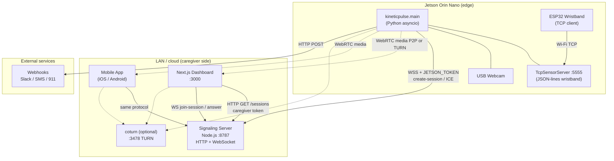
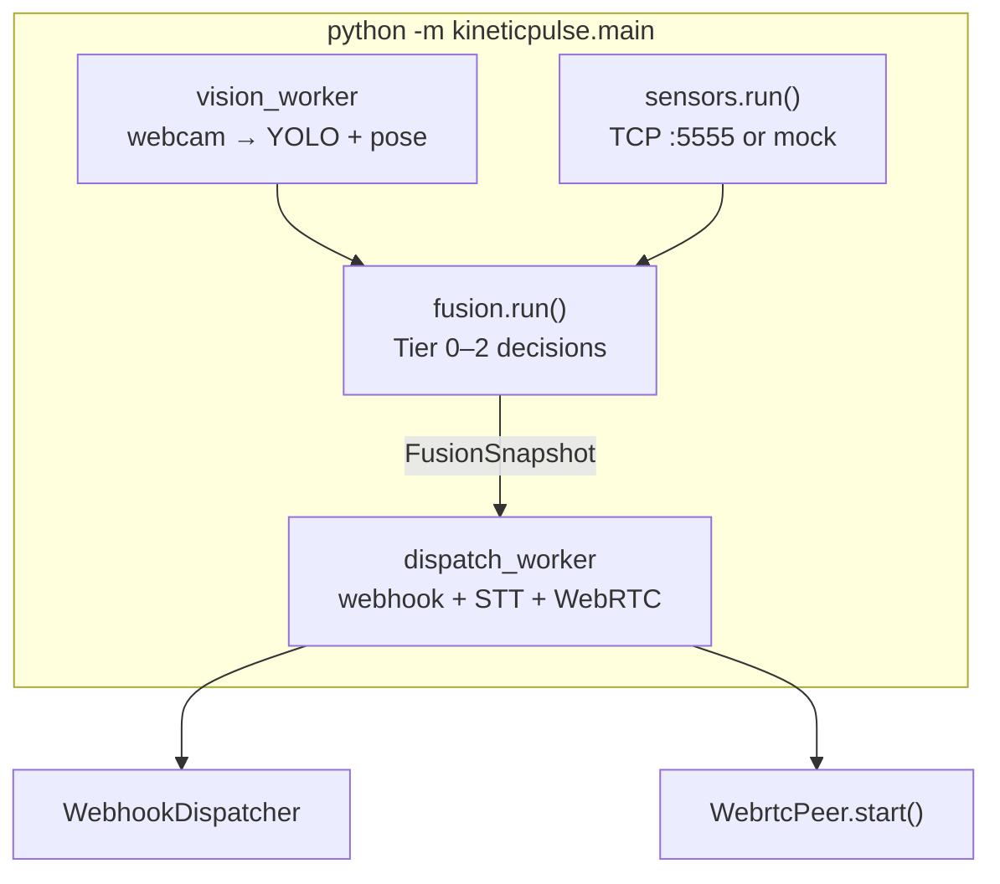
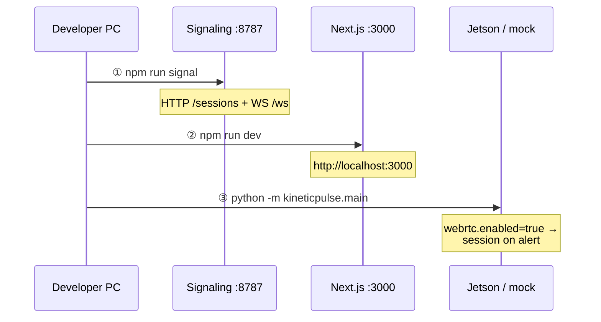
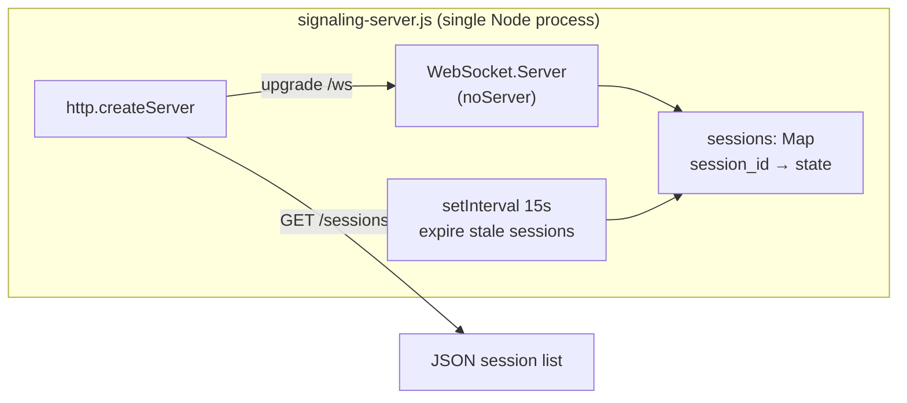
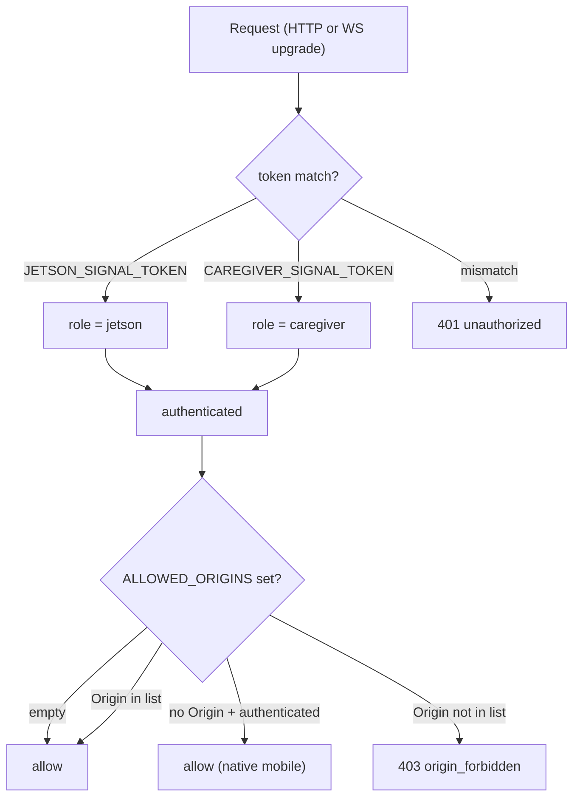
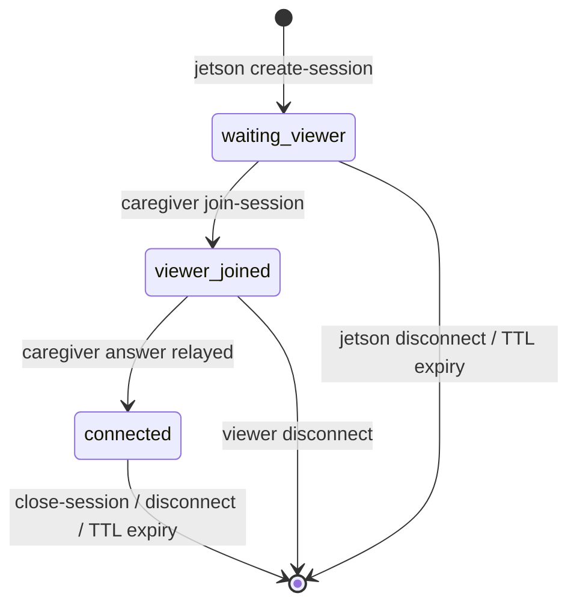
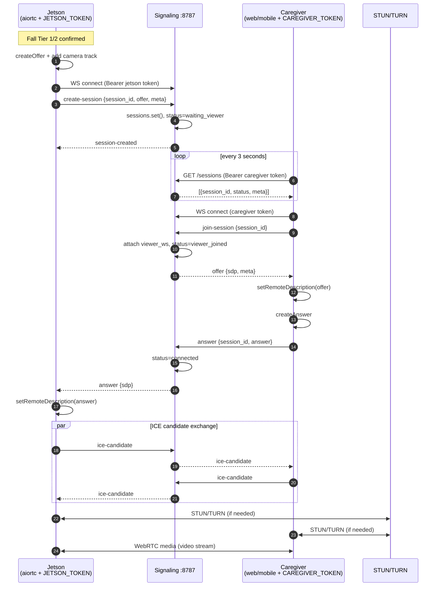
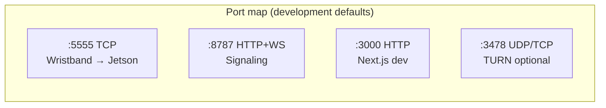
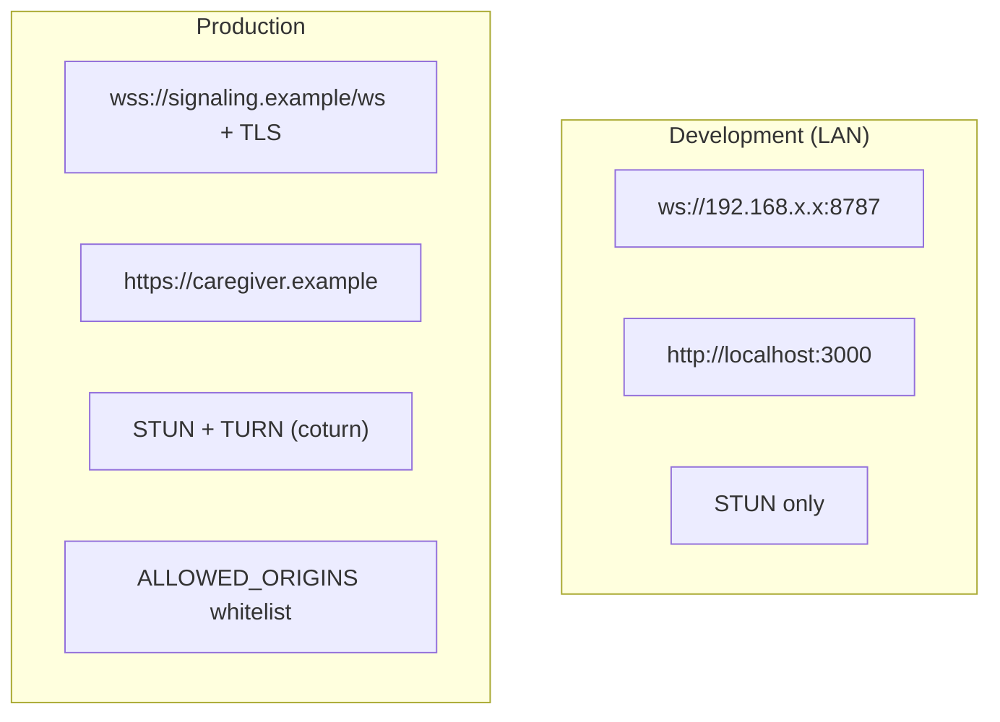
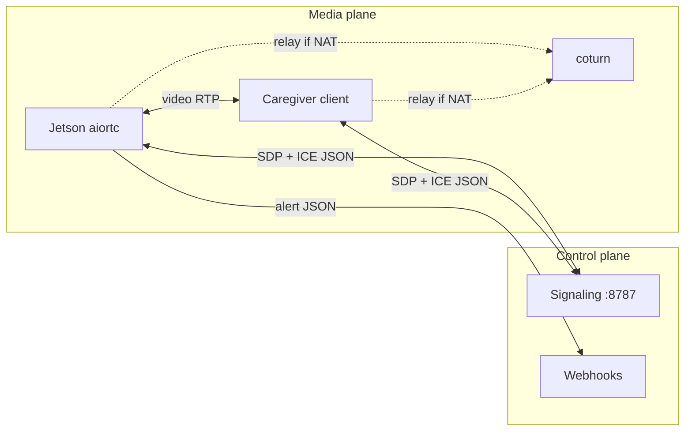

# KineticPulse Server Architecture & Operations Guide

**Document version:** 1.0  
**Last updated:** 2026-06-17  
**Audience:** Software / hardware / operations team  

This report describes how KineticPulse servers and edge processes are structured, how they are started in development and production, and how signaling, WebRTC media, and webhooks relate to one another.

Related documents:

- [dashboard/README.md](../dashboard/README.md) — caregiver dashboard & signaling quick start
- [docs/WEBRTC_ROLLOUT.md](./WEBRTC_ROLLOUT.md) — production rollout checklist
- [mobile/README.md](../mobile/README.md) — iOS / Android caregiver app
- [config.example.yaml](../config.example.yaml) — Jetson runtime WebRTC settings

---

## Table of Contents

1. [Executive summary](#1-executive-summary)
2. [System overview](#2-system-overview)
3. [Component roles](#3-component-roles)
4. [Development startup sequence](#4-development-startup-sequence)
5. [Signaling server internals](#5-signaling-server-internals)
6. [Authentication model](#6-authentication-model)
7. [Session state machine](#7-session-state-machine)
8. [Alert-to-live-video flow](#8-alert-to-live-video-flow)
9. [WebRTC signaling sequence](#9-webrtc-signaling-sequence)
10. [Port map](#10-port-map)
11. [Development vs production](#11-development-vs-production)
12. [Data paths](#12-data-paths)
13. [Local smoke-test procedure](#13-local-smoke-test-procedure)
14. [Environment variables reference](#14-environment-variables-reference)
15. [Failure handling](#15-failure-handling)

---

## 1. Executive summary

KineticPulse does **not** run as a single monolithic server. Responsibilities are split across:

| Layer | Process | Primary role |
|-------|---------|--------------|
| **Edge** | `python -m kineticpulse.main` on Jetson | Fall detection, sensor fusion, webhooks, WebRTC **sender** |
| **Signaling** | `dashboard/server/signaling-server.js` | WebRTC handshake relay (offer / answer / ICE) — **no video** |
| **Caregiver UI** | Next.js (`dashboard/`) or mobile app (`mobile/`) | Session list + WebRTC **receiver** |
| **Optional** | coturn (`dashboard/deploy/`) | TURN relay for NAT traversal |
| **External** | Slack / SMS / 911 webhooks | Alert dispatch only |

**Live video never passes through the signaling server.** The signaling server carries JSON only. Media flows peer-to-peer (or via TURN when NAT requires it).

---

## 2. System overview



**Figure 1 — End-to-end topology.** Solid arrows are control/signaling or alert paths. Dotted arrows are WebRTC media (direct or TURN-relayed).

---

## 3. Component roles

### 3.1 Jetson runtime (`kineticpulse/main.py`)

The edge runtime is an **asyncio** application with four concurrent workers:



**Figure 2 — Jetson internal worker layout.**

| Worker | Module | Responsibility |
|--------|--------|----------------|
| `vision_worker` | `kineticpulse/vision/` | Frame capture, fall detector, pose features, temporal head |
| `sensors` | `kineticpulse/sensors/tcp.py` (etc.) | Wristband telemetry (TCP JSON-lines on port 5555) |
| `fusion` | `kineticpulse/fusion/engine.py` | PRD §5 scenarios A–D → emergency tiers |
| `dispatch_worker` | `kineticpulse/alerts/`, `kineticpulse/webrtc/` | Webhooks, voice verification (Tier 1), WebRTC session start |

When Tier 1 or Tier 2 is confirmed, `_dispatch_worker` generates a `session_id`, builds an `AlertPayload`, and runs **webhook dispatch and WebRTC startup in parallel** via `asyncio.gather`. WebRTC failure does not block webhook delivery (fail-safe design).

### 3.2 Signaling server (`dashboard/server/signaling-server.js`)

A single **Node.js** process exposing:

| Endpoint | Protocol | Purpose |
|----------|----------|---------|
| `GET /sessions` | HTTP | List active emergency sessions (caregiver auth) |
| `WS /ws` | WebSocket | Relay SDP offers/answers and ICE candidates |

Implementation: plain `http` + `ws` — no Express framework. Session state is held **in memory** (`Map<session_id, Session>`).

Start command:

```bash
cd dashboard
npm run signal
```

Default bind: `0.0.0.0:8787`.

### 3.3 Next.js caregiver dashboard (`dashboard/app/`)

A **separate process** from signaling:

| Screen | Path | Behaviour |
|--------|------|-----------|
| Session list | `/` | Polls `GET /sessions` every 3 s |
| Live viewer | `/session/[id]` | WebSocket `join-session` → receives offer → sends answer → renders `<video>` |

Start command:

```bash
cd dashboard
npm run dev    # http://localhost:3000
```

### 3.4 Mobile caregiver app (`mobile/`)

Expo + React Native WebRTC. **No dedicated server** — connects directly to the signaling server using the same caregiver protocol as the web dashboard. Settings screen stores HTTP base, WebSocket base, caregiver token, and ICE servers.

Requires a **development build** (`expo run:ios` / `expo run:android`); Expo Go does not include `react-native-webrtc`.

### 3.5 coturn (optional)

Template: `dashboard/deploy/docker-compose.turn.yml`.

Used when caregivers and Jetson are on different NATs (e.g. LTE vs home Wi-Fi). Both Jetson `config.yaml` and caregiver clients must list the same TURN URLs in `ice_servers`.

### 3.6 Webhooks

Configured under `alerts.webhooks` in `config.yaml`. Dispatched asynchronously via `httpx` when an emergency tier fires. Independent of WebRTC success.

---

## 4. Development startup sequence

Typical local bring-up requires **three terminals** (signaling, dashboard, Jetson/mock):



**Figure 3 — Recommended development startup order.**

### Terminal 1 — Signaling server

```powershell
cd dashboard
$env:JETSON_SIGNAL_TOKEN="your-jetson-secret"
$env:CAREGIVER_SIGNAL_TOKEN="your-caregiver-secret"
$env:ALLOWED_ORIGINS="http://localhost:3000"
npm run signal
```

### Terminal 2 — Web dashboard

```powershell
cd dashboard
$env:NEXT_PUBLIC_SIGNALING_HTTP_BASE="http://localhost:8787"
$env:NEXT_PUBLIC_SIGNALING_WS_BASE="ws://localhost:8787/ws"
$env:NEXT_PUBLIC_CAREGIVER_TOKEN="your-caregiver-secret"
npm run dev
```

### Terminal 3 — Jetson runtime (or laptop mock)

```powershell
python -m kineticpulse.main --config config.yaml `
  --mock-ble --mock-ble-scenario fall_c_syncope --mock-stt --no-camera
```

Required `config.yaml` WebRTC section:

```yaml
webrtc:
  enabled: true
  signaling_url: "ws://localhost:8787/ws"
  auth_token: "your-jetson-secret"    # must match JETSON_SIGNAL_TOKEN
  session_id_prefix: "kp"
  connect_timeout_s: 8.0
  max_session_s: 120.0
  ice_servers:
    - urls: ["stun:stun.l.google.com:19302"]
```

### Mobile app (optional fourth client)

Configure in-app **Server settings**:

- HTTP base: `http://<LAN-IP>:8787`
- WebSocket base: `ws://<LAN-IP>:8787/ws`
- Caregiver token: same as `CAREGIVER_SIGNAL_TOKEN`

---

## 5. Signaling server internals



**Figure 4 — Signaling server internal structure.**

### In-memory session object

| Field | Type | Description |
|-------|------|-------------|
| `session_id` | string | e.g. `kp-a1b2c3d4e5f6` |
| `status` | string | `waiting_viewer` → `viewer_joined` → `connected` |
| `offer` | object | Jetson SDP offer (relayed to caregiver) |
| `meta` | object | tier, scenario, subject_id, location, detector/action labels |
| `jetson_ws` | WebSocket | Jetson signaling connection |
| `viewer_ws` | WebSocket | Caregiver connection (web or mobile; **one viewer per session in v1**) |
| `created_at_ms` | number | Creation timestamp |
| `updated_at_ms` | number | Last activity (ICE, join, etc.) |

### WebSocket message types

| Message | Sender | Action |
|---------|--------|--------|
| `create-session` | jetson | Register session + store offer |
| `session-created` | server → jetson | Acknowledgement |
| `join-session` | caregiver | Attach viewer; server sends stored offer |
| `offer` | server → caregiver | SDP offer + meta |
| `answer` | caregiver | Relay answer to jetson |
| `ice-candidate` | either | Relay to peer |
| `close-session` | either | Tear down session |
| `session-closed` | server | Notify both peers |
| `error` | server | `forbidden`, `session_not_found`, `viewer_already_attached`, etc. |

All frames use JSON: `{"type": "...", "payload": {...}}`.

---

## 6. Authentication model



**Figure 5 — Authentication and origin policy.**

### Token delivery

Tokens may be supplied via:

- Query string: `?token=<value>`
- Header: `Authorization: Bearer <value>`

Comparison uses `crypto.timingSafeEqual` to resist timing attacks.

### Role permissions

| Action | jetson | caregiver |
|--------|--------|-----------|
| `create-session` | ✅ | ❌ |
| `join-session` | ❌ | ✅ |
| `answer` | ❌ | ✅ |
| `ice-candidate` | ✅ | ✅ |
| `close-session` | ✅ | ✅ |
| `GET /sessions` | ✅ | ✅ |

### Native mobile note

React Native WebSocket clients typically send **no `Origin` header**. When `ALLOWED_ORIGINS` is configured, authenticated requests without an Origin are still allowed so iOS/Android apps can connect with a valid caregiver token.

---

## 7. Session state machine



**Figure 6 — Session lifecycle.**

- **TTL:** default 5 minutes (`SESSION_TTL_MS`). Sweeper runs every 15 s.
- **Single viewer:** if a second caregiver joins, server returns `viewer_already_attached`.
- **Disconnect cleanup:** when either WebSocket closes, the session is deleted and the other peer receives `session-closed`.

---

## 8. Alert-to-live-video flow

### 8.1 Tier 2 (voice bypass)

Seizure / cardiac scenarios skip STT and immediately:

1. Generate `session_id` (`kp-` + 12 hex chars)
2. Build `AlertPayload` with vitals + session id
3. `asyncio.gather(webhook dispatch, webrtc.start())`

### 8.2 Tier 1 (voice verification)

1. Play prompt: *"A fall has been detected. Are you okay?"*
2. Run STT for `verify_timeout_s` (default 10 s)
3. If safe keyword + stable vitals → **cancel** (no webhook, no WebRTC)
4. Otherwise → same webhook + WebRTC path as Tier 2

### 8.3 Jetson WebRTC peer (`kineticpulse/webrtc/peer.py`)

On `WebrtcPeer.start()`:

1. Connect `SignalingClient` to `webrtc.signaling_url` with `auth_token`
2. Create `RTCPeerConnection` with configured `ice_servers`
3. Attach `CameraVideoTrack` (OpenCV → aiortc)
4. `createOffer` → `create-session` on signaling server
5. Wait for caregiver `answer` (timeout: `connect_timeout_s`, default 8 s)
6. Start `_signal_loop` for ongoing ICE relay
7. Auto-stop after `max_session_s` (default 120 s)

WebRTC errors are logged as warnings; the main monitoring loop continues.

---

## 9. WebRTC signaling sequence



**Figure 7 — Full WebRTC signaling and media establishment.**

**Caregiver client behaviour (web and mobile are equivalent):**

1. Home screen polls `GET /sessions`
2. User selects a session
3. Open WebSocket → `join-session`
4. Receive `offer` → create `RTCPeerConnection` answer
5. Exchange ICE candidates via signaling server
6. Render remote video track when `ontrack` / `ontrack` fires

---

## 10. Port map



**Figure 8 — Network ports.**

| Process | Command | Port | Protocol |
|---------|---------|------|----------|
| Jetson `kineticpulse.main` | `python -m kineticpulse.main` | **5555** (listen) | TCP JSON-lines (wristband) |
| Signaling server | `npm run signal` | **8787** | HTTP + WebSocket |
| Next.js dashboard | `npm run dev` | **3000** | HTTP (UI only) |
| coturn | `docker compose up` | **3478** | TURN (UDP/TCP) |
| Mobile app | `expo run:ios/android` | — | outbound client only |

---

## 11. Development vs production



**Figure 9 — Development vs production deployment patterns.**

| Concern | Development | Production |
|---------|-------------|------------|
| Signaling URL | `ws://LAN-IP:8787/ws` | `wss://...` behind TLS terminator |
| Dashboard | `http://localhost:3000` | `https://caregiver.example` |
| ICE | Google STUN only | STUN + self-hosted TURN |
| CORS / Origin | often empty `ALLOWED_ORIGINS` | explicit whitelist |
| Tokens | short dev secrets | long random, rotated periodically |
| Media path | LAN P2P often sufficient | TURN relay likely required |

See [WEBRTC_ROLLOUT.md](./WEBRTC_ROLLOUT.md) for the staged production checklist.

---

## 12. Data paths

| Data | Path | Persisted? |
|------|------|------------|
| Fall decision (CV + sensors) | Jetson internal queues → fusion → dispatch | No (in-process) |
| Alert payload (vitals, tier, scenario) | Jetson → webhook HTTP POST | External system |
| Session metadata | Signaling server memory → `GET /sessions` | Until TTL / disconnect |
| SDP offer / answer | Signaling WebSocket (transient relay) | In memory during session |
| ICE candidates | Signaling WebSocket (bidirectional relay) | Transient |
| **Live video** | Jetson ↔ caregiver via WebRTC (or TURN) | **Not via signaling server** |



**Figure 10 — Control plane vs media plane separation.**

---

## 13. Local smoke-test procedure

### Prerequisites

- Node.js 18+ in `dashboard/`
- Python venv with `requirements.txt` installed
- `config.yaml` copied from `config.example.yaml`

### Steps

1. **Start signaling** (Terminal 1)

   ```powershell
   cd dashboard
   $env:JETSON_SIGNAL_TOKEN="dev-jetson"
   $env:CAREGIVER_SIGNAL_TOKEN="dev-caregiver"
   npm run signal
   ```

2. **Start web dashboard** (Terminal 2)

   ```powershell
   cd dashboard
   $env:NEXT_PUBLIC_SIGNALING_HTTP_BASE="http://localhost:8787"
   $env:NEXT_PUBLIC_SIGNALING_WS_BASE="ws://localhost:8787/ws"
   $env:NEXT_PUBLIC_CAREGIVER_TOKEN="dev-caregiver"
   npm run dev
   ```

3. **Configure Jetson WebRTC** in `config.yaml`:

   ```yaml
   webrtc:
     enabled: true
     signaling_url: "ws://localhost:8787/ws"
     auth_token: "dev-jetson"
   ```

4. **Trigger a scripted emergency** (Terminal 3)

   ```powershell
   python -m kineticpulse.main --config config.yaml `
     --mock-ble --mock-ble-scenario fall_c_syncope --mock-stt --no-camera
   ```

5. **Verify**

   - [ ] Session appears on `http://localhost:3000` within ~3 s
   - [ ] Clicking the session opens the viewer page
   - [ ] Connection state reaches `connected` (video may be black with `--no-camera`)
   - [ ] Webhook logs show dispatch attempt (even if URLs disabled)

### LAN testing with a phone

Replace `localhost` with the PC's LAN IP in all URLs. Android emulator may use `10.0.2.2` to reach the host machine.

---

## 14. Environment variables reference

### Signaling server (`npm run signal`)

| Variable | Default | Description |
|----------|---------|-------------|
| `SIGNAL_HOST` | `0.0.0.0` | Bind address |
| `SIGNAL_PORT` | `8787` | HTTP + WS port |
| `JETSON_SIGNAL_TOKEN` | `""` | Token for Jetson role |
| `CAREGIVER_SIGNAL_TOKEN` | `""` | Token for caregiver role |
| `SESSION_TTL_MS` | `300000` (5 min) | Session expiry |
| `ALLOWED_ORIGINS` | `""` (allow all) | Comma-separated CORS origins |

### Next.js dashboard (`npm run dev`)

| Variable | Example | Description |
|----------|---------|-------------|
| `NEXT_PUBLIC_SIGNALING_HTTP_BASE` | `http://localhost:8787` | Session list API |
| `NEXT_PUBLIC_SIGNALING_WS_BASE` | `ws://localhost:8787/ws` | WebSocket endpoint |
| `NEXT_PUBLIC_CAREGIVER_TOKEN` | `dev-caregiver` | Caregiver auth token |

### Jetson runtime (`config.yaml`)

| Key | Description |
|-----|-------------|
| `webrtc.enabled` | Master switch |
| `webrtc.signaling_url` | WebSocket URL (must match signaling server) |
| `webrtc.auth_token` | Must match `JETSON_SIGNAL_TOKEN` |
| `webrtc.ice_servers` | STUN/TURN list for aiortc |
| `webrtc.max_session_s` | Auto-close session timer |
| `wristband.tcp_port` | Wristband ingest (default 5555) |

---

## 15. Failure handling

| Failure | System behaviour |
|---------|------------------|
| Signaling server down | Webhooks still fire; WebRTC start times out and logs warning; monitoring continues |
| WebRTC / aiortc missing | `ImportError` caught; alert path unaffected |
| Caregiver never joins | Session remains `waiting_viewer` until TTL or Jetson disconnect |
| Second caregiver joins | `viewer_already_attached` error |
| Network drop mid-call | Peer `connectionstatechange` → `failed`/`disconnected` → Jetson `stop()`; session cleaned on WS close |
| Signaling auth failure | HTTP 401 / WS upgrade rejected |
| Origin blocked | HTTP 403 when `ALLOWED_ORIGINS` set and Origin not whitelisted (mobile exempt if authenticated, no Origin) |

---

## Appendix A — File reference

| Path | Role |
|------|------|
| `dashboard/server/signaling-server.js` | Signaling server implementation |
| `dashboard/app/page.tsx` | Web session list |
| `dashboard/app/session/[id]/page.tsx` | Web WebRTC viewer |
| `kineticpulse/main.py` | Jetson orchestrator + dispatch worker |
| `kineticpulse/webrtc/peer.py` | Jetson WebRTC peer (aiortc) |
| `kineticpulse/webrtc/signaling_client.py` | Jetson WebSocket signaling client |
| `mobile/src/hooks/useCaregiverPeer.ts` | Mobile WebRTC caregiver hook |
| `dashboard/deploy/docker-compose.turn.yml` | coturn deployment template |

---

## Appendix B — Glossary

| Term | Definition |
|------|------------|
| **Signaling** | JSON exchange of SDP and ICE — not media |
| **SDP offer/answer** | Session Description Protocol negotiation for WebRTC |
| **ICE** | Interactive Connectivity Establishment — finds network path between peers |
| **STUN** | Discovers public IP; helps with simple NAT |
| **TURN** | Relays media when P2P cannot be established |
| **Tier 1** | Verify via voice before escalation |
| **Tier 2** | Critical — bypass voice, immediate webhook + WebRTC |

---

*End of document.*
